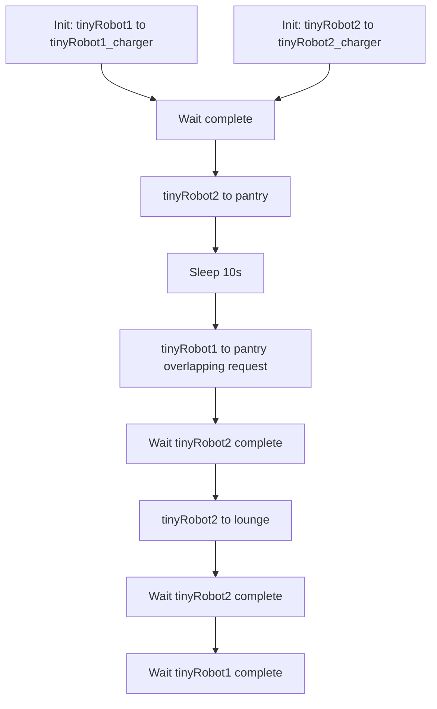
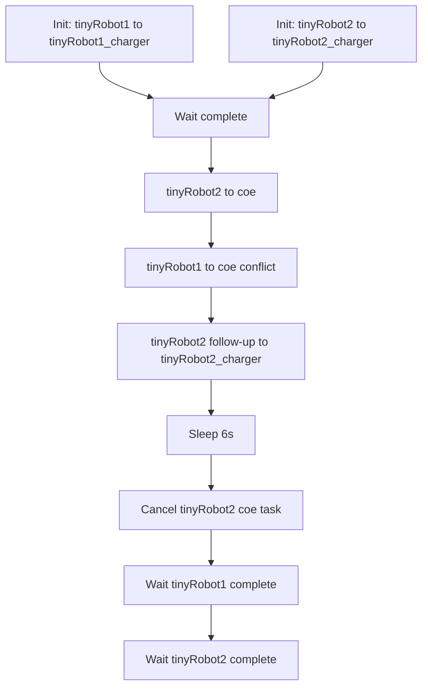
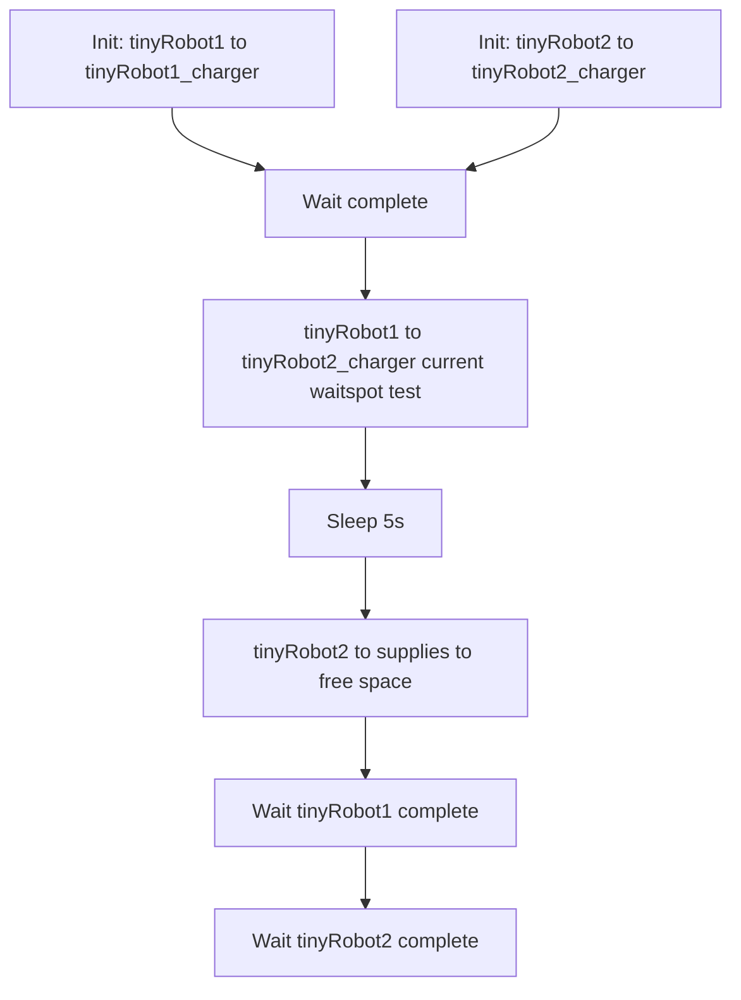
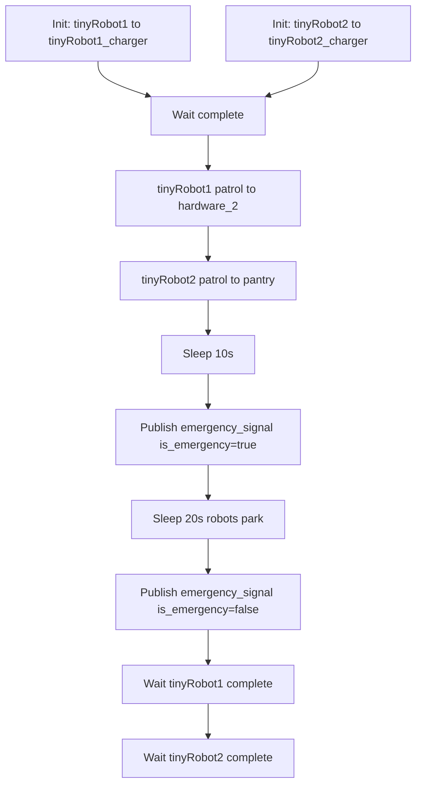
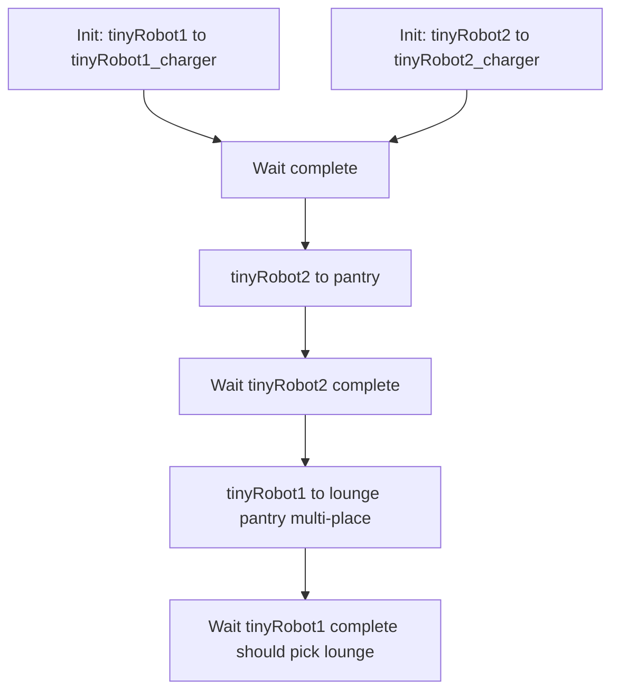
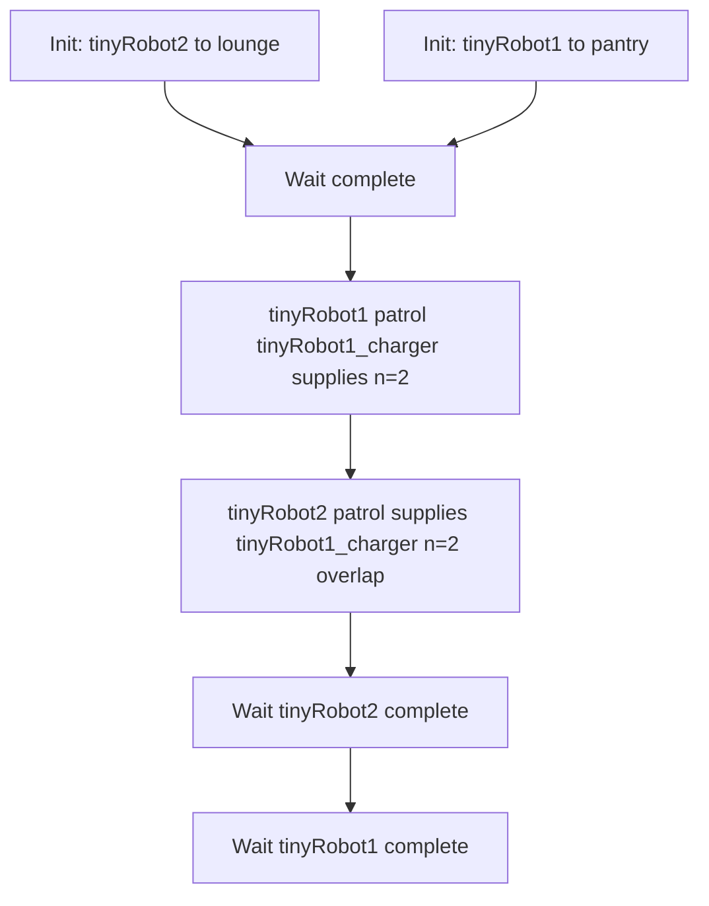
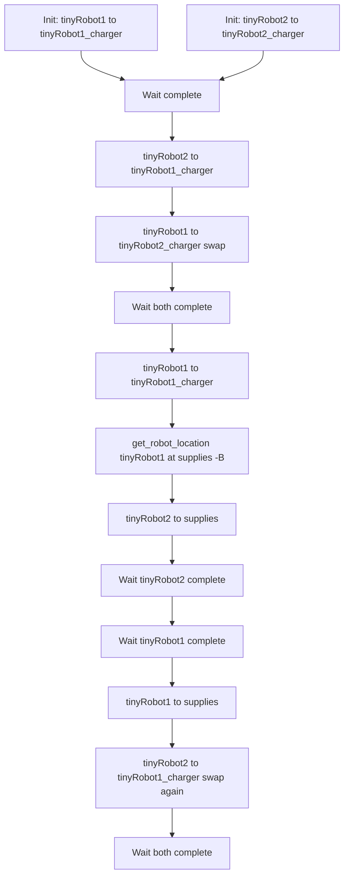

# Open-RMF High-Level Stress Tests

This folder contains bash scripts for high-level integration tests of Open-RMF. Each script initializes two tiny robots, dispatches tasks via `rmf_demos_tasks`, and verifies completion.

## test_basic

## test_cancellation

## test_current_waitspot

## test_emergency_pullover

## test_multi_place

## test_patrol

## test_swap

